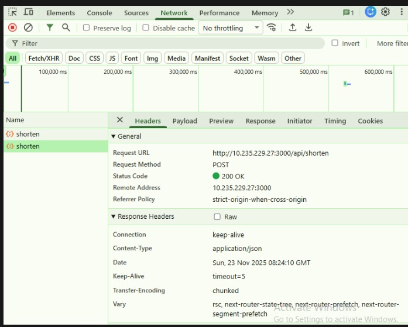
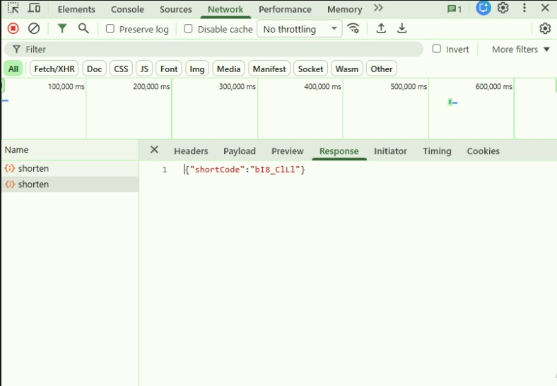

# URL Shortener – Next.js + Prisma + NeonDB

A fully functional URL Shortener built using **Next.js (App Router)**, **Prisma ORM**, and **NeonDB** as the managed PostgreSQL database.  
The application allows users to shorten long URLs, copy shortened URLs to clipboard, and track visit counts.

---

## 🚀 Features

- Shorten long URLs using nanoid  
- Store URLs in NeonDB  
- Auto-refresh after shortening  
- Copy to clipboard with UI feedback  
- Visit counter with automatic increment  
- Clean UI using shadcn/ui + TailwindCSS  

---

## 🧱 Tech Stack

| Layer | Technology |
|------|------------|
| Frontend | Next.js 16 (App Router) |
| ORM | Prisma |
| Database | NeonDB (PostgreSQL) |
| UI | TailwindCSS + shadcn/ui |
| Deployment | Vercel |

---

## 📦 Project Structure

```
/app
  /api
    /shorten/route.ts
    /urls/route.ts
  /[shortcode]/page.tsx
/components/ui
  shortenForm.tsx
  urlList.tsx
  url-shortener-container.tsx
/lib/db.ts
/prisma/schema.prisma
```

---

## ⚙️ Environment Variables

Create a `.env` file:

```
DATABASE_URL=your_neon_database_url
NEXT_PUBLIC_BASE_URL=http://localhost:3000
```

---

## 🗄️ Prisma Commands

Generate client:
```
npx prisma generate
```

Run migrations:
```
npx prisma migrate dev --name init
```

Open DB viewer:
```
npx prisma studio
```

---

## 🔥 API Endpoints

### POST `/api/shorten`
Request:
```json
{ "url": "https://example.com" }
```

Response:
```json
{ "shortCode": "AbC12345" }
```

---

### GET `/api/urls`
Returns last 5 shortened URLs.

---

### GET `/:shortcode`
Redirect handler that:
- Finds the original URL  
- Increments visit count  
- Redirects to the original URL  

---

## 🚀 How to Run Locally

```
npm install
npm run dev
```

Server runs at:
```
http://localhost:3000
```


---

## TESTING RESULTS (POSTMAN & NETWORK CONSOLE)







---


## 📚 Future Enhancements

- Custom alias for links  
- QR Code generation  
- Analytics dashboard  
- User authentication  

---

## 🙌 Author
**Ujjwal Mishra**
ujjwalmishra523@gmail.com

